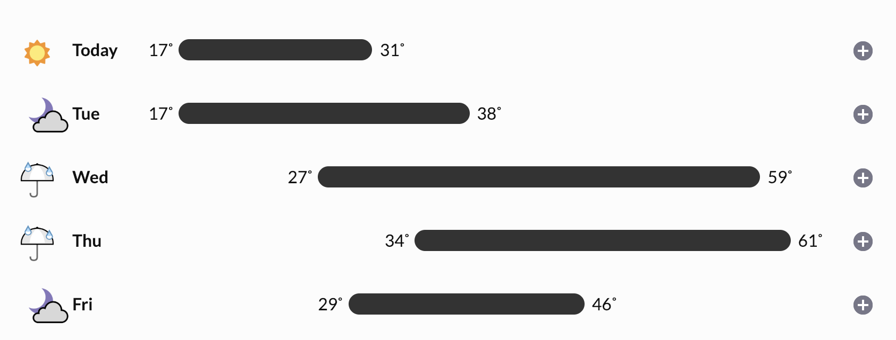

exclude: true

```{r, message=FALSE, warning=FALSE, include=FALSE}
options(
  htmltools.dir.version = FALSE, # for blogdown
  width=80
)

htmltools::tagList(rmarkdown::html_dependency_font_awesome())
```

---
class: middle
count: false

# Attributes

---

## Attributes

Attributes are metadata that can be attached to objects in R. Some are special (e.g. `class`, `comment`, `dim`, `dimnames`, `names`, etc.) and change the way in which an object is treated by R. 

Attributes are a named list that is attached to an R object, they can be accessed (get and set) individually via the `attr` and collectively via `attributes`.

.midi[

```{r}
(x = c(L=1,M=2,N=3))
str(x)
attributes(x)

```
]

---

```{r}
str(attributes(x))
```

--

```{r}
attr(x,"names") = c("A","B","C")
x
```

--

```{r}
names(x)
names(x) = c("Z","Y","X")
x
```

---

## Factors

Factor objects are how R represents categorical data (e.g. a variable where there are a fixed #s of possible outcomes).

```{r}
(x = factor(c("BS", "MS", "PhD", "MS")))
```

--

```{r}
str(x)
```

--

```{r}
typeof(x)
```

---

## 

A factor is just an integer vector with two attributes: `class = "factor"` and `levels = ` a character vector.

```{r}
attributes(x)
```

---

## Exercise 1

Construct a factor variable (without using `factor`, `as.factor`, or related functions) that contains the weather forecast for Durham over the next 5 days.

<br/>

```{r out.width="80%", fig.align="center", echo=FALSE}

```


* There should be 5 levels - `sun`, `partial clouds`, `clouds`, `rain`, `snow`.

* Start with an *integer* vector and add the appropriate attributes.


---
class: middle
count: false

# Data Frames

---

## Data Frames

A data frame is how R handles heterogeneous tabular data (i.e. rows and columns) and is one of the most commonly used data structure in R.

At their core R represents data frames as a list of equal length vectors (usually atomic, but you can use lists as well).

```{r}
df = data.frame(x = 1:3, y = c("a", "b", "c"))
df
str(df)
```
---

```{r}
typeof(df)
attributes(df)
```

---

## Roll your own data.frame

```{r}
df2 = list(x = 1:3, y = factor(c("a", "b", "c")))
```

--

.pull-left[
```{r}
attr(df2,"class") = "data.frame"
df2
```
]

--

.pull-right[
```{r}
attr(df2,"row.names") = 1:3
df2
```
]

```{r}
str(df2)
identical(df, df2)
```

---

## Strings (Characters) vs Factors

By default character vectors will be convert into factors when they are included in a data frame. 

Sometimes this is useful, usually it isn't -- either way it is important to know what type/class you are working with. This behavior can be changed using the `stringsAsFactors` argument to data.frame and related functions.

```{r}
df = data.frame(x = 1:3, y = c("a", "b", "c"), stringsAsFactors = FALSE)
df
str(df)
```
---

## Some general advice ...

<br/>
<br/>


---

## Length Coercion

For data frames if the lengths of the component vectors are not multiples then there will be an error (previous examples this only produced a warning).

```{r error=TRUE}
data.frame(x = 1:3, y = c("a"))
data.frame(x = 1:3, y = c("a","b"))
data.frame(x = 1:3, y = character())
```
---

## Growing data frames 

We can add rows or columns to a data frame using `rbind` and `cbind` respectively.

```{r}
df = data.frame(x = 1:3, y = c("a","b","c"))
cbind(df, z=TRUE)
```

.pull-left[
```{r}
rbind(df, c(1,"a"))
```
]

.pull-right[
```{r}
str( rbind(df, c(1,"a")) )
```
]


---

.pull-left[
```{r}
rbind(df, list(1,"a"))
```
]

.pull-right[
```{r}
str( rbind(df, list(1,"a")) )
```
]

--

```{r}
df1 = data.frame(x = 1:3, y = c("a","b","c"))
df2 = data.frame(m = 3:1, n = c(TRUE,TRUE,FALSE))
```

```{r error=TRUE}
cbind(df1, df2)
rbind(df1, df2)
```

---

## Matrices

A matrix is a 2 dimensional equivalent of an atomic vector (i.e. all entries must share the same type).

```{r}
(m = matrix(c(1,2,3,4), ncol=2, nrow=2))

attributes(m)
```

---

## Column major ordering

A matrix is an atomic vector with a `dim` attribute. Data is stored in column major order (fill the first column starting at row one, then the next column and so on).

.pull-left[
```{r}
cm = matrix(c(1,2,3,4), 
            ncol=2, nrow=2)

cm
c(cm)
```
]

.pull-right[
```{r}
rm = matrix(c(1,2,3,4), 
            ncol=2, nrow=2, 
            byrow=TRUE)
rm
c(rm)
```
]

---
class: middle
count: false

# S3 Objects

---

## What is S3?

<br/>

> S3 is R’s first and simplest OO system. It is the only OO system used in the base and stats packages, and it’s the most commonly used system in CRAN packages. S3 is informal and ad hoc, but it has a certain elegance in its minimalism: you can’t take away any part of it and still have a useful OO system.

--Hadley Wickham, Advanced R

.footnote[
* S3 should not be confused with R's other object oriented systems: S4, Reference classes, and R6*.
]

---

## `class`
.pull-left[
```{r}
class( 1 )
class( "A" )
class( NA )
class( TRUE )
```
]

.pull-right[
```{r}
class( matrix(1,2,2) )
class( factor(c("A","B")) )
class( data.frame(x=1:3) )
class( (function(x) x^2) )
```
]

---


## An example

.pull-left[
```{r}
print( c("A","B","A","C") )
print( factor(c("A","B","A","C")) )
```
]

.pull-right[
```{r}
print( data.frame(a=1:3, b=4:6) )
```
]

--

<br/>

```{r}
print
```

---

## Other examples

.pull-left[
```{r}
mean
t.test
```
]

.pull-right[
```{r}
summary
plot
```
]


```{r}
sum
```

---

## What's going on?

S3 objects and their related functions work using a very simple dispatch mechanism - a generic function is created whose sole job is to call the `UseMethod` function which then calls a class specialized function named using the convention: `generic.class`.

We can see all of the specialized versions of the generic using the `methods` function.

```{r}
methods("plot")
```

---

.small[
```{r}
methods("print")
```
]

---

```{r}
print.data.frame
```
---

```{r error=TRUE}
print.matrix
```

--

```{r}
print.default
```

---

## The other way

If instead we have a class and want to know what specialized functions exist for that class, then we can again use the `methods` function - this time with the `class` argument.

```{r}
methods(class="data.frame")
```

---
class: small

```{r}
`[.data.frame`
```

---

## Adding methods

```{r include=FALSE}
rm(print.x)
rm(print.y)
```

.pull-left[
```{r}
x = structure(c(1,2,3), class="x")

x
```
]

.pull-right[
```{r}
y = structure(c(1,2,3), class="y")

y
```
]

--

<div>
.pull-left[
```{r}
print.x = function(x) 
  print("Class x!")

x
```
]

.pull-right[
```{r}
print.y = function(y) 
  print("Class y!")

y
```
]
</div>

--

<div>
.pull-left[
```{r}
class(x) = "y"
x
```
]

.pull-right[
```{r}
class(y) = "x"
y
```
]
</div>

---

## Defining a new S3 Generic

```{r}
shuffle = function(x, ...) {
  UseMethod("shuffle")
}

shuffle.default = function(x) {
  n = length(x)
  x[sample(seq_len(n),n)]
}

shuffle.data.frame = function(df) {
  n = nrow(df)
  df[sample(seq_len(n),n),]
}
```

--

.pull-left[
```{r}
shuffle( 1:10 )
shuffle( letters[1:5] )
```
]

.pull-right[
```{r}
shuffle( 
  data.frame(a=1:4, b=5:8, c=9:12)
)
```
]

---
class: middle
count: false

# Tibbles

---

## Modern data frames

Hadley Wickham has a package that modifies data frames to be more modern, or as he calls them surly and lazy.

```{r}
library(tibble)
class(iris)
tbl_iris = as_tibble(iris)
class(tbl_iris)
```

---

## Fancy Printing

```{r}
tbl_iris
```

---

## Fancier printing

```{r}
data_frame(x = rnorm(10,sd=5), y = rnorm(10))
```

---

## Tibbles are lazy

```{r}
tbl_iris[1,]
```

.pull-left[
```{r}
tbl_iris[,"Species"]
```
]

--

.pull-right[
```{r}
data_frame(
  x = 1:3, 
  y = c("A","B","C")
)
```
]

---

## Multiple classes

```{r}
d = data_frame(
  x = 1:3, 
  y = c("A","B","C")
)

class(d)
```

--

<br/>

```{r}
class(d) = rev(class(d))
class(d)
d
```

---

## Reverting a tbl

```{r}
d = data_frame(
  x = 1:3, 
  y = c("A","B","C")
)

d
```

.pull-left[
```{r}
data.frame(d)
```
]

.pull-right[
```{r}
class(d) = "data.frame"
d
```
]


---

## Acknowledgments

Above materials are derived in part from the following sources:

* Hadley Wickham - [Advanced R](http://adv-r.had.co.nz/)
* [R Language Definition](http://stat.ethz.ch/R-manual/R-devel/doc/manual/R-lang.html)
