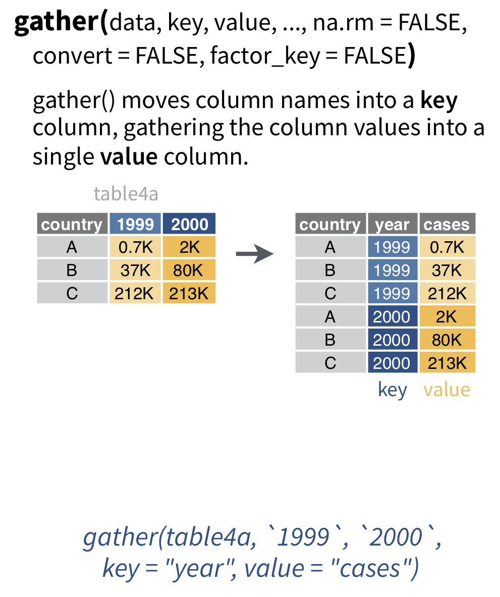
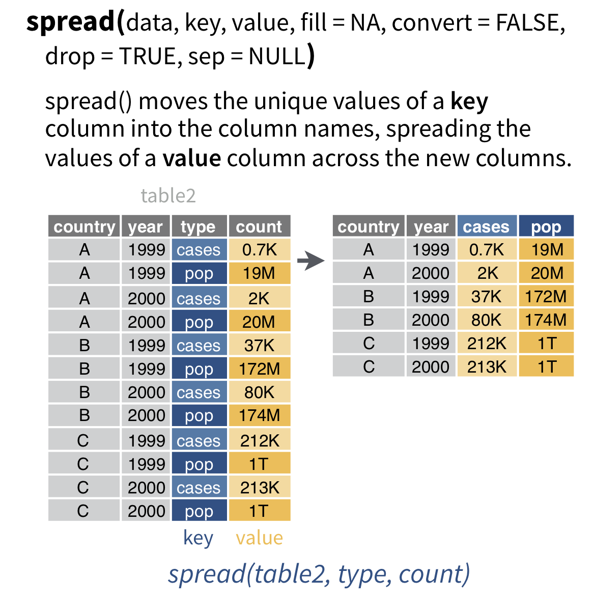
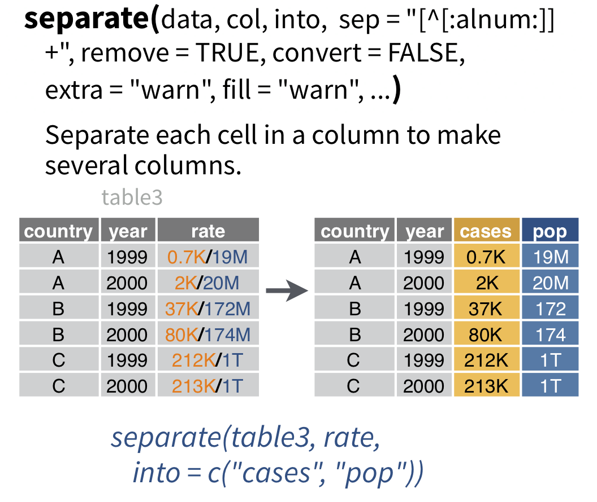
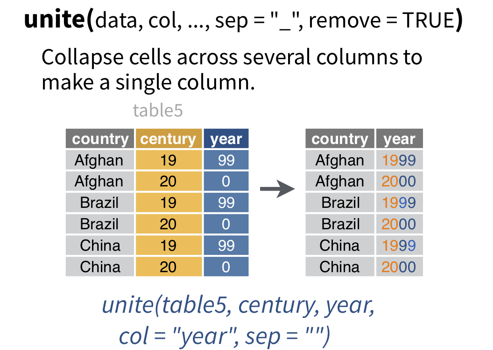

exclude: true

```{r setup, message=FALSE, warning=FALSE, include=FALSE}
options(
  htmltools.dir.version = FALSE, # for blogdown
  width = 80,
  tibble.width = 80
)

htmltools::tagList(rmarkdown::html_dependency_font_awesome())

library(dplyr)
library(purrr)
library(tidyr)
library(magrittr)
```

---

## Tidy data

```{r echo=FALSE, out.width="100%"}
knitr::include_graphics('imgs/tidy.png')
```
* One variable per column
* One observation per row
* Each type of observational unit forms a table

.footnote[ From R4DS - [tidy data](r4ds.had.co.nz/tidy-data.html) ]

---
class: middle
count: false

.center[
```{r echo=FALSE, out.width="50%"}
knitr::include_graphics('imgs/hex-tidyr.png')
```
]

---

## Gather

```{r echo=FALSE, out.width="60%", fig.align="center"}

```

.footnote[ From [data import cheatsheet](https://github.com/rstudio/cheatsheets/blob/master/data-import.pdf) ]

---

## Spread

```{r echo=FALSE, out.width="70%", fig.align="center"}

```

.footnote[ From [data import cheatsheet](https://github.com/rstudio/cheatsheets/blob/master/data-import.pdf) ]

---

## Separate

```{r echo=FALSE, out.width="70%", fig.align="center"}

```

.footnote[ From [data import cheatsheet](https://github.com/rstudio/cheatsheets/blob/master/data-import.pdf) ]

---

## Unite

```{r echo=FALSE, out.width="70%", fig.align="center"}

```

.footnote[ From [data import cheatsheet](https://github.com/rstudio/cheatsheets/blob/master/data-import.pdf) ]

---
class: middle
count: false

# Example 1 - Grades

---

## Tidy?

```{r}
grades = tibble(
  name  = c("Alice", "Bob", "Carol", "Dave"),
  hw_1   = c(19, 18, 18, 19),
  hw_2   = c(19, 20, 20, 19),
  hw_3   = c(18, 18, 18, 18),
  hw_4   = c(20, 16, 17, 19),
  exam_1 = c(89, 77, 96, 86),
  exam_2 = c(95, 88, 99, 82)
)
```

---

## Wide -> Long (Gather)

.small[ .pull-left[
```{r}
gather(grades, item, score, hw_1:exam_2)
```
] ]

--

.small[ .pull-right[
```{r}
gather(grades, item, score, -name)
```
] ]

---

## Untidy approach

```{r}
grades %>%
  mutate(
    hw_avg = (hw_1+hw_2+hw_3+hw_4)/4,
    exam_avg = (exam_1+exam_2)/2,
    overall = 0.4*(exam_avg/100) + 0.6*(hw_avg/20)
  )
```

---

## Tidy approach

```{r}
grades %>%
  gather(item, score, -name) %>%
  separate(item, c("type","num"), sep = "_") %>%
  group_by(name, type) %>%
  summarize(avg = mean(score)) %>%
  spread(type, avg) %>%
  mutate(overall = 0.4*(exam/100) + 0.6*(hw/20))
```

---
class: middle
count: false

# Example 2 - tb

---

## Tidy?

```{r message=FALSE}
(tb = readr::read_csv(
  paste0("https://github.com/tidyverse/",
  "tidyr/raw/master/vignettes/tb.csv")
))
```

---
## Codebook

| Column | Meaning             |
|--------|:--------------------|
| `iso2` |  2 digit iso country code
| `year` |  year
| `m04`  |  Males, 0 - 4
| `m514` |  Males, 5 - 14
| `m014` |  Males, 0 - 14
| ...    | ...
| `m65`  |  Males, 65+
| `mu`   |  Males, unknown
| ...    | ...

---

## Moving columns to rows

.pull-left[
```{r}
tb %>% 
  gather(
    group, counts, 
    -iso2, -year
  
  )
```
]

.pull-right[
```{r}
tb %>% 
  gather(
    group, counts, 
    -iso2, -year, 
    na.rm = TRUE
  )
```
]

---

## Moving columns to rows

```{r}
tb %>% 
  gather(group, counts, -iso2, -year, na.rm = TRUE) %>%
  separate(group, into = c("gender","age"), 1)
``` 

---

## Fixing ages

```{r}
(tb = tb %>% 
  gather(group, counts, -iso2, -year, na.rm=TRUE) %>%
  separate(group, into = c("gender","age"), 1) %>%
  mutate(
    age = case_when(
      age == "04" ~ "0-4",     age == "514" ~ "5-14",
      age == "014" ~ "0-14",   age == "1524" ~ "15-24",
      age == "2534" ~ "25-34", age == "3544" ~ "35-44",
      age == "4554" ~ "45-54", age == "5564" ~ "55-64",
      age == "65" ~ "65+",     age == "u" ~ NA_character_
    )
  )
)
``` 

---

## Moving rows to columns

```{r}
tb %>%
  spread(gender, counts) %>%
  mutate(total = m + f)
```

---

## Exercise 1

.small[ 
`NETemp.dat` contains monthly temperature data (Celsius) recorded across the Northeastern US starting in January 2000. Using these data calculate the average monthly temperature across all of these sites.

```{r}
data("NETemp.dat", package = "spBayes")
(ne_temp = as_tibble(NETemp.dat))
```
]
