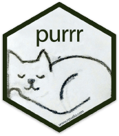

exclude: true

```{r, message=FALSE, warning=FALSE, include=FALSE}
options(
  htmltools.dir.version = FALSE, # for blogdown
  width = 80,
  tibble.width = 80
)

htmltools::tagList(rmarkdown::html_dependency_font_awesome())

library(purrr)
library(magrittr)
```


---
class: middle
count: false

# Functions

---

## When to use functions

The goal of a function is to encapsulate a *small* *reusable* piece of code.

* Name should make it clear what the function does (think in terms of simple verbs).

* Functionality should be simple enough to be quickly understood.

* The smaller and more modular the code the easier it will be to reuse elsewhere.

* **D**ont **R**epeat **Y**ourself - change code in only one location

---

## Function Parts

The two parts of a function are the arguments (`formals`) and the code (`body`).

```{r}
gcd = function(long1, lat1, long2, lat2) {
  R = 6371 # Earth mean radius in km
  # distance in km
  acos(sin(lat1)*sin(lat2) + cos(lat1)*cos(lat2) * cos(long2-long1)) * R
}
```

--

.pull-left[
```{r}
formals(gcd)
```
]

.pull-right[
```{r}
body(gcd)
```
]

---

## Argument names

When defining a function we are also implicitly defining names for the arguments, when calling the function we can use these names to pass arguments in a different order.


```{r}
f = function(x, y, z) {
  paste0("x=",x," y=",y," z=",z)
}
```

.pull-left[
```{r,error=TRUE}
f(1,2,3)
f(z=1,x=2,y=3)
```
]

.pull-right[
```{r,error=TRUE}
f(y=2,1,3)
f(y=2,1,x=3)
```
]

```{r,error=TRUE}
f(1,2,3,m=1)
```

---

## Argument defaults

It is also possible to give function arguments default values so that they don't need to be provided every time the function is called.

```{r error=TRUE}
f = function(x, y=1, z=1) {
  paste0("x=",x," y=",y," z=",z)
}
```

```{r error=TRUE}
f()
f(x=3)
f(y=2,2)
```

---

## Scope

R has generous scoping rules, if it can't find a variable in the functions body, it will look for it in the next higher scope, and so on.

```{r}
y = 1
f = function(x) {
  x+y
}
f(3)
```

```{r}
g = function(x) {
  y=2
  x+y
}
g(3)
```

---

Additionally, variables defined within a scope only persist for the duration of that scope, and do not overwrite variables at higher scopes (unless you use the global assignment operator `<<-`, *which you shouldn't*)

```{r}
x = 1
y = 1
z = 1
f = function() {
    y = 2
    g = function() {
      z = 3
      return(x + y + z)
    }
    return(g())
}
f()
c(x,y,z)
```

---

## Lazy evaluation

Arguments to R functions are lazily evaluated - meaning they are not evaluated until they are used 

```{r, error=TRUE}
f = function(x) {
  cat("Hello world!\n")
  x
}

f(stop())
```

---

## Everything is a function

```{r}
`+`
typeof(`+`)
x = 4:1
`+`(x,2)
```

---

## Getting details

Prefixing any function name with a `?` will open the related help file for that function.

```{r, eval=FALSE}
?`+`
?sum
```

For (most) functions you can see their implementation by entering the function name without parentheses (or using the `body` function).

```{r}
lm
```

---

## Less Helpful Examples

```{r}
list

`[`

sum

`+`
```

---

## Infix functions (operators)

We can define our own infix functions like `+` or `*`, the only requirement is that they must start and end with a `%`.

```{r}
`%nand%` = function(x, y) {
  !(x & y)
}
```

.pull-left[
```{r}
TRUE %nand% TRUE
TRUE %nand% FALSE
```
]

.pull-right[
```{r}
FALSE %nand% TRUE
FALSE %nand% FALSE
```
]

---

## Replacement functions

We can also define functions that allow for 'inplace' modification like `attr` or `names`.

```{r, error=TRUE}
`last<-` = function(x, value) {
  x[length(x)] = value
  x
}
```

--

```{r, error=TRUE}
x = 1:10
last(x) = 5L
x
last(1)
```

---

## `...` argument

This is a special argument that captures all arguments that are not matched explicitly. In order to capture the arguments we almost always use `list(...)`. 

```{r}
f = function(x=1, y=2, ...) {
  str(list(...))
}
```

.pull-left[
```{r}
f(1,2)
f(1,2,3)
```
]

.pull-right[
```{r}
f(1,2,3,4)
f(z=3)
```
]


---
class: middle
count: false

# Functional Programming

---

## Functional Programming

<br/>

.medium[

* First order functions 

* Pure functions

* Anonymous functions

* Vectorized functions

* *Closures*

* *Recursion*

]

---
class: middle
count: false

# Apply functions

---

## Apply functions

The apply functions are a collection of tools for functional programming in R, they are variations of the `map` function found in many other languages

```{r, eval=FALSE}
??apply
---

## 
## Help files with alias or concept or title matching ‘apply’ using fuzzy
## matching:
## 
## base::apply             Apply Functions Over Array Margins
## base::.subset           Internal Objects in Package 'base'
## base::by                Apply a Function to a Data Frame Split by Factors
## base::eapply            Apply a Function Over Values in an Environment
## base::lapply            Apply a Function over a List or Vector
## base::mapply            Apply a Function to Multiple List or Vector Arguments
## base::rapply            Recursively Apply a Function to a List
## base::tapply            Apply a Function Over a Ragged Array
```

---

## lapply

Usage: `lapply(X, FUN, ...)`

`lapply` returns a list of the same length as `X`, each element of which is the result of applying `FUN` to the corresponding element of `X`.

<br/>

.pull-left[
```{r}
lapply(1:8, sqrt) %>% str()
```
]

.pull-right[
```{r}
lapply(1:8, function(x) (x+1)^2) %>% str()
```
]

---

```{r}
lapply(1:8, function(x, pow) x^pow, pow=3) %>% str()
lapply(1:8, function(x, pow) x^pow, x=2) %>% str()
```

---

## sapply

Usage: `sapply(X, FUN, ..., simplify = TRUE, USE.NAMES = TRUE)`

`sapply` is a *user-friendly* version and wrapper of `lapply`, it is a *simplifying* version of lapply. Whenever possible it will return a vector, matrix, or an array.

<br/>

```{r}
sapply(1:8, sqrt)
sapply(1:8, function(x) (x+1)^2)
```

---

```{r}
sapply(1:8, function(x) c(x, x^2, x^3, x^4))
sapply(1:8, function(x) list(x, x^2, x^3, x^4))
```

---

```{r}
sapply(2:6, seq)
```

---

## [ls]apply and data frames

We can use these functions with data frames, the key is to remember that a data frame is just a fancy list.

```{r}
df = data.frame(a = 1:6, b = letters[1:6], c = c(TRUE,FALSE))
lapply(df, class) %>% str()
sapply(df, class)
```

---

## other less common applies

* `apply(X, MARGIN, FUN, ...)` - applies a function over the rows or columns of a data frame, matrix or array

* `vapply(X, FUN, FUN.VALUE, ..., USE.NAMES = TRUE)` - is similar to `sapply`, but has a enforced return type and size

* `mapply(FUN, ..., MoreArgs = NULL, SIMPLIFY = TRUE, USE.NAMES = TRUE)` -  like `sapply` but will iterate over multiple vectors at the same time.

* `rapply(object, f, classes = "ANY", deflt = NULL, how = c("unlist", "replace", "list"), ...)` - a recursive version of `lapply`, behavior depends largely on the `how` argument

* `eapply(env, FUN, ..., all.names = FALSE, USE.NAMES = TRUE)` -  apply a function over an environment.

---

## Example 1

Using the `sw_people` data set in the `repurrrsive` package, extract the names of all of the characters using:

* a for loop

* one of the apply functions

---
class: middle
count: false

# purrr

---

## purrr

.center[
```{r echo=FALSE}

```
]


A tidyverse package which improves the functional programming tools in R, it focuses on *pure* and *type stable* functions.


---

## Map functions

Basic functions for looping over an object and returning a value (of a specific type) - replacement for `lapply`/`sapply`/`vapply`.

* `map()` - returns a list.

* `map_lgl()` - returns a logical vector.

* `map_int()` - returns a integer vector.

* `map_dbl()` - returns a double vector.

* `map_chr()` - returns a character vector.

* `map_df()` / `map_dfr()` - returns a data frame by row binding.

* `map_dfc()` - returns a data frame by column binding.

* `walk()` - returns nothing, call function exclusively for its side effects


---

## Type Consistency

R is a weakly / dynamically typed language which means there is no simple way to define a function which enforces the argument or return types. This flexibility can be useful at times, but often it makes it hard to reason about your code and requires more verbose code to handle edge cases.

```{r}
x = list(rnorm(1e3),rnorm(1e3),rnorm(1e3))
```
```{r}
map_dbl(x, mean)
```
```{r}
map_chr(x, mean)
```
```{r error=TRUE}
map_int(x, mean)
```

---

## Shortcut - Anonymous Functions

An anonymous function is one that is never given a name (assigned to a variable)

```{r}
sapply(1:5, function(x) x^(x+1))
```

purrr lets us write anonymous functions using one sided formulas where the argument is given by `.` or `.x` for `map` and related functions.

```{r}
map_dbl(1:5, ~ .^(.+1))
```

```{r}
map_dbl(1:5, ~ .x^(.x+1))
```

---

## Shortcut - Anonymous Functions - `map2`

Functions with the `map2` prefix work the same as the `map` functions but they iterate over two vectors instead of one. Arguments are instead given by `.x` and `.y` (or `..1` and `..2`) respectively.

```{r}
map2_dbl(1:5, 1:5, ~ .x^(.y+1))

map2_dbl(1:5, 1:5, ~ ..1^(..2+1))

map2_chr(letters[1:5], LETTERS[1:5], paste0)
```

---

## Purrr shortcut - Lookups

Very often we want to extract only certain (named) values from a list, `purrr` provides a shortcut for this operation when you provide either a character or numeric value instead of a function to apply.


```{r}
x = list(list(a=1L,b=2L,c=list(d=3L,e=4L)),
         list(a=5L,b=6L,c=list(d=7L,e=8L,f=9L)))
```     

--

.pull-left[
```{r}
map_int(x, "a")
map_dbl(x, c("c","e"))
map_chr(x, list(3,"d"))
```
]

--

.pull-right[
```{r}
map_df(x, 3)
map_dfc(x, 3)
```
]


---

```{r}
x = list(list(a=1L,b=2L,c=list(d=3L,e=4L)),
         list(a=5L,b=6L,c=list(d=7L,e=8L,f=9L)))
``` 

```{r error=TRUE}
map(x, list(3,"f"))

map_int(x, list(3,"f"))

map_int(x, list(3,"f"), .default=NA)
```

---

## Example 2

Using the `sw_people` data set again, generate a tidy data frame (tibble) containing as many details as possible.

```{r}
library(repurrrsive)
```

.pull-left[
```{r}
str(sw_people,max.level = 1)
```
]

.pull-right[
```{r}
str(sw_people,max.level = 2)
```
]


---
class: middle
count: false

# Acknowledgments

---

## Acknowledgments

Above materials are derived in part from the following sources:

* Hadley Wickham - [Adv-R Functionals](http://adv-r.had.co.nz/Functionals.html)

* Hadley Wickham - [R for Data Science](http://r4ds.had.co.nz/)

* Neil Saunders - [A brief introduction to "apply" in R](http://nsaunders.wordpress.com/2010/08/20/a-brief-introduction-to-apply-in-r/)

* Jenny Bryan - [Purrr Tutorial](https://jennybc.github.io/purrr-tutorial/)

* [R Language Definition](http://stat.ethz.ch/R-manual/R-devel/doc/manual/R-lang.html)

