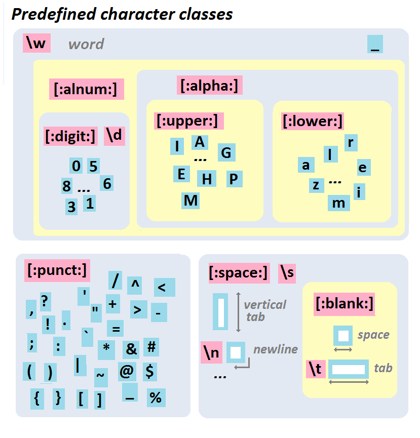

exclude: true

```{r, message=FALSE, warning=FALSE, include=FALSE}
options(
  htmltools.dir.version = FALSE, # for blogdown
  width = 80,
  tibble.width = 80
)

knitr::opts_chunk$set(
  fig.align = "center"
)

htmltools::tagList(rmarkdown::html_dependency_font_awesome())
```

```{r setup, message=FALSE}
library(stringr)
```

---
class: middle
count: false

```{r echo=FALSE, fig.align="center", out.width="33%"}
knitr::include_graphics("https://github.com/rstudio/hex-stickers/raw/master/PNG/stringr.png")
```

---

## stringr

stringr is a package for handling character strings, it is designed to improve / simplify string handling relative to base R and make it more similar to Python's string library. Most of the package's functions are wrappers for base R functions. 

.small[
| Function     | Description                         |
|:-------------|:------------------------------------|
|`str_detect`  | Detect the presence or absence of a pattern in a string. |
|`str_locate`  | Locate the first position of a pattern and return a matrix with start and end. |
|`str_extract` | Extracts text corresponding to the first match. |
|`str_match`   | Extracts capture groups formed by `()` from the first match. |
|`str_split`   | Splits string into pieces and returns a list of character vectors. |
|`str_replace` | Replaces the first matched pattern and returns a character vector. |
|`str_remove`  | Removes the first matched pattern and returns a character vector. |
]

<br />
Many of these functions have variants with an `_all` suffix (e.g. `str_replace_all`) which will match more than one occurrence of the pattern in a given string.

---
class: middle
count: false

# Regular Expressions

---

## Simple Pattern Detection

```{r}
text = c("The","quick","brown","fox","jumps","over","the","lazy","dog")
```

--

```{r}
str_detect(text, "quick")
```

--

```{r}
str_detect(text, "o")
```

--

```{r}
str_detect(text, "row")
```

---

## Aside - Escape Characters 

An escape character is a character which results in an alternative interpretation of the subsequent character(s). These vary from language to language but for most string implementations `\` is the escape character which is modified by a single following character.

Some common examples:

.small[
| Literal | Character        |
|:--------|:-----------------|
|`\'`     | single quote     |
|`\"`     | double quote     |
|`\\`     | backslash        |
|`\n`     | new line         |
|`\r`     | carriage return  |
|`\t`     | tab              |
|`\b`     | backspace        |
|`\f`     | form feed        |
]

---

## Examples

.pull-left[
```{r error=TRUE}
print("a\"b")
print("a\tb")
print("a\nb")
print("a\\b")
```
]

.pull-right[
```{r error=TRUE}
cat("a\"b")
cat("a\tb")
cat("a\nb")
cat("a\\b")
```
]

---

## RegEx Metacharacters

The power of regular expressions comes from their ability to use special metacharacters to modify how pattern matching is performed.

```regex
. ^ $ * + ? { } [ ] \ | ( )
```

--

Because of their special properties they cannot be matched directly, if you need to match one you need to escape it first (precede it by `\`). The problem is that regex escapes live on top of string escapes, so there needs to use *two* levels of escapes.

<br/>

--

| Pattern | Regex | Literal   |
|---------|-------|-----------|
| `.`     | `\.`  | `"\\."`   |
| `?`     | `\?`  | `"\\?"`   |
| `!`     | `\!`  | `"\\!"`   |


---

## Example

```{r error=TRUE}
str_detect("abc[def","\[")
```

--

```{r error=TRUE}
str_detect("abc[def","\\[")
```

--

How do we detect if a string contains a `\` character?

--

```{r}
cat("abc\\def\n")
```

--

```{r}
str_detect("abc\\def","\\\\")
```

---

## XKCD's take


```{r echo=FALSE, fig.align="center"}
knitr::include_graphics("imgs/xkcd_backslashes.png")
```


---

## Anchors

Sometimes we want to specify that our pattern occurs at a particular location in a string, we indicate this using anchor metacharacters.

<br />

| Regex | Anchor    |
|-------|:----------|
| `^` or `\A` | Start of string   |
| `$` or `\Z` | End of string     |
| `\b`        | Word boundary     |  
| `\B`        | Not word boundary |

---

## Anchor Examples

```{r}
text = "the quick brown fox jumps over the lazy dog"
```

--

```{r}
str_replace(text,"^the","---")
```

--

```{r}
str_replace(text,"^dog","---")
```

--

```{r}
str_replace(text,"the$","---")
```

--

```{r}
str_replace(text,"dog$","---")
```


---

## Anchor Examples

```{r}
text = "the quick brown fox jumps over the lazy dog"
```

--

```{r}
str_replace_all(text,"\\Brow\\B","---")
```

--

```{r}
str_replace_all(text,"\\brow\\b","---")
```

--

```{r}
str_replace_all(text,"\\bthe","---")
```

--

```{r}
str_replace_all(text,"the\\b","---")
```


---

## More complex patterns

If there are more than one pattern we would like to match we can use the or (`|`) metacharacter.

--

```{r}
str_replace_all(text,"the|dog","---")
```

--

```{r}
str_replace_all(text,"a|e|i|o|u","-")
```

--

```{r}
str_replace_all(text,"\\ba|e|i|o|u","-")
```

--

```{r}
str_replace_all(text,"\\b(a|e|i|o|u)","-")
```


---

## Character Classes

When we want to match whole classes of characters at a time there are a number of convenience patterns built in,

<br />

| Meta Char | Class | Description |
|:----:|:------------|:-|
| `.`  |             | Any character except new line (`\n`) | 
| `\s` | `[:space:]` | White space |
| `\S` |             | Not white space |
| `\d` | `[:digit:]` | Digit (0-9)|
| `\D` |             | Not digit |
| `\w` |             | Word (A-Z, a-z, 0-9, or _) |
| `\W` |             | Not word |
|      | `[:punct:]` | Punctionation |

---

## A hierarchical view

<center>
  
</center>

.small[
From http://perso.ens-lyon.fr/lise.vaudor/strings-et-expressions-regulieres/
]

---

## Example

How would we write a regular expression to match a telephone number with the form `(###) ###-####`?

```{r}
text = c("apple", "(219) 733-8965", "(329) 293-8753")
```

--

```{r error=TRUE}
str_detect(text, "(\d\d\d) \d\d\d-\d\d\d\d")
```

--

```{r}
str_detect(text, "(\\d\\d\\d) \\d\\d\\d-\\d\\d\\d\\d")
```

--

```{r}
str_detect(text, "\\(\\d\\d\\d\\) \\d\\d\\d-\\d\\d\\d\\d")
```


---

## Classes and Ranges

We can also specify our own classes using the square bracket meta character

<br />

| Class    | Type        |
|----------|:------------|
| `[abc]`  | Class (a or b or c) |
| `[^abc]` | Negated class (not a or b or c) |
| `[a-c]`  | Range lower case letter from a to c |
| `[A-C]`  | Range upper case letter from A to C |
| `[0-7]`  | Digit between 0 to 7 |

---

## Example

```{r}
text = c("apple", "(219) 733-8965", "(329) 293-8753")
```

--

```{r}
str_replace_all(text, "[aeiou]", "&")
```

--

```{r}
str_replace_all(text, "[13579]", "*")
```

--

```{r}
str_replace_all(text, "[1-5a-ep]", "^")
```

---

## Exercises 1

For the following vector of randomly generated names, write a regular expression that,

* detects if the person's first name starts with a vowel (a,e,i,o,u)

* detects if the person's last name starts with a vowel

* detects if either the person's first or last name start with a vowel

* detects if neither the person's first nor last name start with a vowel


```{r echo=FALSE, comment=""}
library(randomNames)
set.seed(124)
dput(randomNames(20, name.order="first.last", name.sep=" "))
```


---

## Quantifiers

Attached to literals or character classes these allow a match to repeat some number of time.

<br />

| Quantifier | Description |
|:-----------|:------------|
| `*`        | Match 0 or more |
| `+`        | Match 1 or more |
| `?`        | Match 0 or 1 |
| `{3}`      | Match Exactly 3 |
| `{3,}`     | Match 3 or more |
| `{3,5}`    | Match 3, 4 or 5 |

---

## Example

How would we improve our previous regular expression for matching a telephone number with the form `(###) ###-####`?

```{r}
text = c("apple", "(219) 733-8965", "(329) 293-8753")
```

--

```{r}
str_detect(text, "\\(\\d\\d\\d\\) \\d\\d\\d-\\d\\d\\d\\d")
```

--

```{r}
str_detect(text, "\\(\\d{3}\\) \\d{3}-\\d{4}")
```

---

## Greedy vs ungreedy matching

What went wrong here?

```{r}
text = "<div class='main'> <div> <a href='here.pdf'>Here!</a> </div> </div>"
```

```{r}
str_extract(text, "<div>.*</div>")
```

<br/>

--

If you add `?` after a quantifier, the matching will be *non-greedy* (find the shortest possible match, not the longest). 

```{r}
str_extract(text, "<div>.*?</div>")
```

---

## Groups

Groups allow you to connect pieces of a regular expression for modification or capture.

<br />

| Group     | Description |
|-----------------|:------------|
| (a &vert; b)    | match literal "a" or "b", group either |
| `a(bc)?`        | match "a" or "abc", group bc or nothing |
| `(abc)def(hig)` | match "abcdefhig", group abc and hig |
| `(?:abc)`       | match "abc", non-capturing group | 

---

## Example

```{r}
text = c("Bob Smith", "Alice Smith", "Apple")
```

--

```{r}
str_extract(text, "^[:alpha:]+")
```

--

```{r}
str_match(text, "^([:alpha:]+) [:alpha:]+")
```

--

```{r}
str_match(text, "^([:alpha:]+) ([:alpha:]+)")
```


---

## How not to use a RegEx

Validating an email address:

<br />

.small[
```
(?:[a-z0-9!#$%&'*+/=?^_`{|}~-]+(?:\.[a-z0-9!#$%&'*+/=?^_`{|}~-]+)*|"
(?:[\x01-\x08\x0b\x0c\x0e-\x1f\x21\x23-\x5b\x5d-\x7f]|\\[\x01-\x09\x0b\x0c\x0e-\x7f])*")
@(?:(?:[a-z0-9](?:[a-z0-9-]*[a-z0-9])?\.)+[a-z0-9](?:[a-z0-9-]*[a-z0-9])?|\[
(?:(?:25[0-5]|2[0-4][0-9]|[01]?[0-9][0-9]?)\.){3}
(?:25[0-5]|2[0-4][0-9]|[01]?[0-9][0-9]?|[a-z0-9-]*[a-z0-9]:
(?:[\x01-\x08\x0b\x0c\x0e-\x1f\x21-\x5a\x53-\x7f]|\\[\x01-\x09\x0b\x0c\x0e-\x7f])+)\])
```
]

---

## Exercise 2

```{r}
text = c(
  "apple", 
  "219 733 8965", 
  "329-293-8753",
  "Work: (579) 499-7527; Home: (543) 355 3679"
)
```

* Write a regular expression that will extract *all* phone numbers contained in the vector above.


* Once that works use groups to extracts the area code separately from the rest of the phone number.

---

# Acknowledgments

---

## Acknowledgments

* Hadley Wickham - [stringr vigneete](https://cran.r-project.org/web/packages/stringr/vignettes/stringr.html)

* David Child - [RegEx Cheat Sheet](http://www.cheatography.com/davechild/cheat-sheets/regular-expressions/)

* [Regular-Expression.info](http://www.regular-expressions.info/)