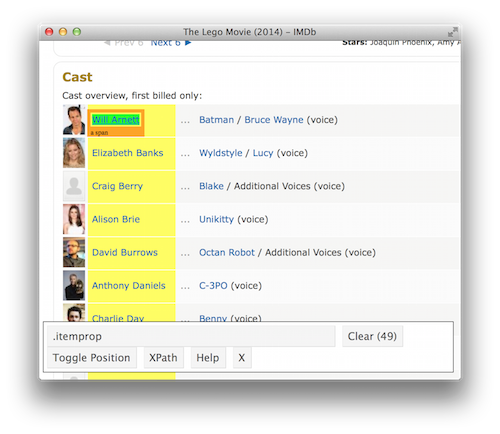

exclude: true

```{r, message=FALSE, warning=FALSE, include=FALSE}
options(
  htmltools.dir.version = FALSE, # for blogdown
  width = 80,
  tibble.width = 80
)

knitr::opts_chunk$set(
  fig.align = "center"
)

htmltools::tagList(rmarkdown::html_dependency_font_awesome())
```

```{r setup, message=FALSE}
library(magrittr)
library(rvest)
```

---
class: middle
count: false

# Web Scraping with rvest

---

## Hypertext Markup Language

Most of the data on the web is still largely available as HTML - while it is structured (hierarchical / tree based) it often is not available in a form useful for analysis (flat / tidy).

```html
<html>
  <head>
    <title>This is a title</title>
  </head>
  <body>
    <p align="center">Hello world!</p>
    <br/>
    <div class="name" id="first">John</div>
    <div class="name" id="last">Doe</div>
    <div class="contact">
      <div class="home">555-555-1234</div>
      <div class="home">555-555-2345</div>
      <div class="work">555-555-9999</div>
      <div class="fax">555-555-8888</div>
    </div>
  </body>
</html>
```

---

## rvest

`rvest` is a package from Hadley Wickham that makes basic processing and manipulation of HTML data straight forward.

<br/>

Core functions:

* `read_html` - read HTML data from a url or character string.

* `html_nodes` - select specified nodes from the HTML document usign CSS selectors.

* `html_table` - parse an HTML table into a data frame.

* `html_text` - extract tag pairs' content.

* `html_name` - extract tags' names.

* `html_attrs` - extract all of each tag's attributes.

* `html_attr` - extract tags' attribute value by name.

---

## html, rvest, & xml2

```{r}
html = 
'<html>
  <head>
    <title>This is a title</title>
  </head>
  <body>
    <p align="center">Hello world!</p>
    <br/>
    <div class="name" id="first">John</div>
    <div class="name" id="last">Doe</div>
    <div class="contact">
      <div class="home">555-555-1234</div>
      <div class="home">555-555-2345</div>
      <div class="work">555-555-9999</div>
      <div class="fax">555-555-8888</div>
    </div>
  </body>
</html>'


read_html(html)
```

---

## css selectors

We will be using a tool called selector gadget to help up identify the html elements of interest - it does this by constructing a css selector which can be used to subset the html document.

.small[

Selector          |  Example         | Description
:-----------------|:-----------------|:--------------------------------------------------
element           |  `p`             | Select all &lt;p&gt; elements
element element   |  `div p`         | Select all &lt;p&gt; elements inside a &lt;div&gt; element
element>element   |  `div > p`       | Select all &lt;p&gt; elements with &lt;div&gt; as a parent
.class            |  `.title`        | Select all elements with class="title"
#id               |  `#name`         | Select all elements with id="name"
[attribute]       |  `[class]`       | Select all elements with a class attribute
[attribute=value] |  `[class=title]` | Select all elements with class="title"

]

---

## Selecting tags

```{r}
read_html(html) %>% html_nodes("p")
```

--

```{r}
read_html(html) %>% html_nodes("p") %>% html_text()
```

--

```{r}
read_html(html) %>% html_nodes("p") %>% html_attrs()
```

--

```{r}
read_html(html) %>% html_nodes("p") %>% html_attr("align")
```

---

## More selecting tags

```{r}
read_html(html) %>% html_nodes("div")
```

--

```{r}
read_html(html) %>% html_nodes("div") %>% html_text()
```


---

## Nesting tags

```{r}
read_html(html) %>% html_nodes("body div")
```

--

```{r}
read_html(html) %>% html_nodes("body>div")
```

--

```{r}
read_html(html) %>% html_nodes("body div div")
```

---

## CSS, classes, and ids

```{r}
read_html(html) %>% html_nodes(".name")
```

--


```{r}
read_html(html) %>% html_nodes("div.name")
```

--

```{r}
read_html(html) %>% html_nodes("#first")
```


---

## Mixing it up

```{r}
read_html(html) %>% html_nodes("[align]")
```

```{r}
read_html(html) %>% html_nodes(".contact div")
```

---

## html tables

```{r}
html_table = 
'<html>
  <head>
    <title>This is a title</title>
  </head>
  <body>
    <table>
      <tr> <th>a</th> <th>b</th> <th>c</th> </tr>
      <tr> <td>1</td> <td>2</td> <td>3</td> </tr>
      <tr> <td>2</td> <td>3</td> <td>4</td> </tr>
      <tr> <td>3</td> <td>4</td> <td>5</td> </tr>
    </table>
  </body>
</html>'
```

--

```{r}
read_html(html_table) %>% html_nodes("table") %>% html_table()
```

---

## SelectorGadget

This is a javascript based tool that helps you interactively build an appropriate CSS selector for the content you are interested in.


<center>
 <br/>
<a href='http://selectorgadget.com/'>http://selectorgadget.com/</a>
</center>

---

## Exercise

### Step 1

For the movies listed in the **Top Box Office** list on `rottentomatoes.com` create a data frame with the Movies' titles, their weekend gross, their tomatometer score, and whether the movie is fresh or rotten.

<br/>


### Step 2

Using the url for each movie, now go out and grab the average rating, number of reviews, number of fresh and rotten reviews as well as the audience score, average audience rating and number of user ratings.
