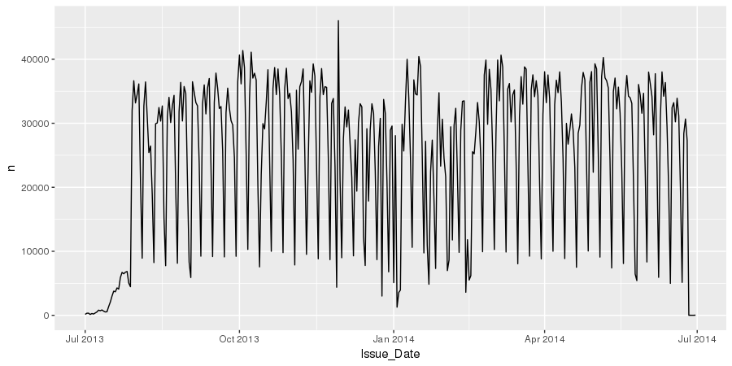

exclude: true

```{r setup, echo=FALSE, message=FALSE, warning=FALSE, include=FALSE}
options(
  htmltools.dir.version = FALSE, # for blogdown
  width = 80,
  tibble.width = 80
)

knitr::opts_chunk$set(
  fig.align = "center"
)

htmltools::tagList(rmarkdown::html_dependency_font_awesome())

library(dplyr)
```

---
class: middle
count: false

# Background

---

## Big vs Bigish data

* We will be working with data that is large, but it will still fit in memory. 

* R *loves* to make extra copies of objects, so we need to be careful - even a handful of copies with exhaust the memory on most systems. 
    
    * Less of an issue on gort / saxon (256 GB of Ram), but this is a shared resource - use too much and your session will be killed.


---
class: middle
count: false

# Reading Data

---

## Reading NYC parking data

If we use the basic approach of `read.csv`, we end up waiting a really long time,

```{r, eval=FALSE}
system.time(read.csv("/data/nyc_parking/nyc_parking_2014.csv"))

##    user  system elapsed  
## 377.359   7.080 384.411 
```

Over 6 minutes to read in a 1.7 gigabyte CSV file.

---

## Improvements 

If we use `stringsAsFactors` and `comment.char` arguments we can speed things up a bit.

```{r, eval=FALSE}
system.time(
  read.csv(
    "/data/nyc_parking/nyc_parking_2014.csv", 
    stringsAsFactors=FALSE, 
    comment.char=""
  )
)

##    user  system elapsed 
## 281.399   4.615 285.975 
```

We can take this farther by specifying the structure of the data using the `colClasses` argument.

---

## Alternatives - data.table

.small[
```{r, eval=FALSE}
system.time({
  nyc_fread = data.table::fread("/data/nyc_parking/nyc_parking_2014.csv")
})

## |--------------------------------------------------|
## |==================================================|
##    user  system elapsed 
##  44.636   2.393  24.606 

class(nyc_fread)

## "data.table" "data.frame"

nyc = as.data.frame(nyc_fread)
class(nyc)

## [1] "data.frame"
```
]

---

## Alternatives - readr 

.small[
```{r, eval=FALSE}
system.time({
  nyc = readr::read_csv("/data/nyc_parking/nyc_parking_2014.csv")
})
  
## Parsed with column specification:
## cols(
##   .default = col_character(),
##   `Summons Number` = col_double(),
##   `Violation Code` = col_integer(),
##   `Street Code1` = col_integer(),
##   `Street Code2` = col_integer(),
##   `Street Code3` = col_integer(),
##   `Vehicle Expiration Date` = col_integer(),
##   `Violation Precinct` = col_integer(),
##   `Issuer Precinct` = col_integer(),
##   `Issuer Code` = col_integer(),
##   `Date First Observed` = col_integer(),
##   `Law Section` = col_integer(),
##   `Violation Legal Code` = col_integer(),
##   `Unregistered Vehicle?` = col_integer(),
##   `Vehicle Year` = col_integer(),
##   `Feet From Curb` = col_integer()
## )
## See spec(...) for full column specifications.
## |========================================| 100% 1713 MB

##   user  system elapsed 
## 97.474  10.719 129.293 
``` 
]

---

## Problems

.small[
```{r, eval=FALSE}
readr::problems(nyc)

## # A tibble: 654,437 x 5
##      row col                  expected   actual file                                       
##    <int> <chr>                <chr>      <chr>  <chr>                                      
##  1  2647 Violation Legal Code an integer T      '/data/nyc_parking/nyc_parking_2014.csv'
##  2  3792 Violation Legal Code an integer T      '/data/nyc_parking/nyc_parking_2014.csv'
##  3  4001 Violation Legal Code an integer T      '/data/nyc_parking/nyc_parking_2014.csv'
##  4  4002 Violation Legal Code an integer T      '/data/nyc_parking/nyc_parking_2014.csv'
##  5  4003 Violation Legal Code an integer T      '/data/nyc_parking/nyc_parking_2014.csv'
##  6  4004 Violation Legal Code an integer T      '/data/nyc_parking/nyc_parking_2014.csv'
##  7  4005 Violation Legal Code an integer T      '/data/nyc_parking/nyc_parking_2014.csv'
##  8  4006 Violation Legal Code an integer T      '/data/nyc_parking/nyc_parking_2014.csv'
##  9  4019 Violation Legal Code an integer T      '/data/nyc_parking/nyc_parking_2014.csv'
## 10  4059 Violation Legal Code an integer T      '/data/nyc_parking/nyc_parking_2014.csv'
## # ... with 654,427 more rows
```
]

---

## readr 

This is a recent package that is designed to be a fast and friendly way of reading tabular data into R.

<br/>

Core features:

* Faster than base R (~3-4x)

* No strings as factors

* No column name mangling

* Consistent argument/function naming scheme

* Plays nice with dplyr (`tbl_df`)

* Progress bars

---

.small[
```{r, eval=FALSE}
nyc

## Source: local data frame [9,100,278 x 43]
## 
##    Summons Number Plate ID Registration State Plate Type issue_date Violation Code
##             (dbl)    (chr)              (chr)      (chr)      (chr)          (int)
## 1      1361929741  FCJ5493                 NY        PAS 12/18/1970             20
## 2      1366962000  63540MC                 NY        COM 02/02/1971             46
## 3      1356906515  GFM1421                 NY        PAS 09/18/1971             40
## 4      1342296217  FYM5117                 NY        SRF 09/18/1971             21
## 5      1342296199  95V6675                 TX        PAS 09/18/1971             21
## 6      1342296187  GCY4187                 NY        SRF 09/18/1971             21
## 7      1337077380  18972BB                 NY        999 10/10/1971             14
## 8      1364523796  WNJ4730                 VA        PAS 04/05/1973             14
## 9      1359914924  68091JZ                 NY        COM 07/22/1973             46
## 10     1355498326  EWV4127                 NY        PAS 08/12/1973             21
## ..            ...      ...                ...        ...        ...            ...
## Variables not shown: Vehicle Body Type (chr), Vehicle Make (chr), Issuing Agency (chr),
##   Street Code1 (int), Street Code2 (int), Street Code3 (int), Vehicle Expiration Date
##   (int), Violation Location (chr), Violation Precinct (int), Issuer Precinct (int),
##   Issuer Code (int), Issuer Command (chr), Issuer Squad (chr), Violation Time (chr), Time
##   First Observed (chr), Violation County (chr), Violation In Front Of Or Opposite (chr),
##   House Number (chr), Street Name (chr), Intersecting Street (chr), Date First Observed
##   (int), Law Section (int), Sub Division (chr), Violation Legal Code (int), Days Parking
##   In Effect (chr), From Hours In Effect (chr), To Hours In Effect (chr), Vehicle Color
##   (chr), Unregistered Vehicle? (int), Vehicle Year (int), Meter Number (chr), Feet From
##   Curb (int), Violation Post Code (chr), Violation Description (chr), No Standing or
##   Stopping Violation (chr), Hydrant Violation (chr), Double Parking Violation (chr)
```
]

---

## Fixing column names

.small[
```{r eval=FALSE}
(nyc = janitor::clean_names(nyc))

## # A tibble: 9,100,278 x 43
##    summons_number plate_id registration_st… plate_type issue_date violation_code
##             <dbl> <chr>    <chr>            <chr>      <chr>               <int>
##  1     1361929741 FCJ5493  NY               PAS        12/18/1970             20
##  2     1366962000 63540MC  NY               COM        02/02/1971             46
##  3     1356906515 GFM1421  NY               PAS        09/18/1971             40
##  4     1342296217 FYM5117  NY               SRF        09/18/1971             21
##  5     1342296199 95V6675  TX               PAS        09/18/1971             21
##  6     1342296187 GCY4187  NY               SRF        09/18/1971             21
##  7     1337077380 18972BB  NY               999        10/10/1971             14
##  8     1364523796 WNJ4730  VA               PAS        04/05/1973             14
##  9     1359914924 68091JZ  NY               COM        07/22/1973             46
## 10     1355498326 EWV4127  NY               PAS        08/12/1973             21
## # ... with 9,100,268 more rows, and 37 more variables: vehicle_body_type <chr>,
## #   vehicle_make <chr>, issuing_agency <chr>, street_code1 <int>, street_code2 <int>,
## #   street_code3 <int>, vehicle_expiration_date <int>, violation_location <chr>,
## #   violation_precinct <int>, issuer_precinct <int>, issuer_code <int>,
## #   issuer_command <chr>, issuer_squad <chr>, violation_time <chr>,
## #   time_first_observed <chr>, violation_county <chr>,
## #   violation_in_front_of_or_opposite <chr>, house_number <chr>, street_name <chr>,
## #   intersecting_street <chr>, date_first_observed <int>, law_section <int>,
## #   sub_division <chr>, violation_legal_code <int>, days_parking_in_effect <chr>,
## #   from_hours_in_effect <chr>, to_hours_in_effect <chr>, vehicle_color <chr>,
## #   unregistered_vehicle <int>, vehicle_year <int>, meter_number <chr>,
## #   feet_from_curb <int>, violation_post_code <chr>, violation_description <chr>,
## #   no_standing_or_stopping_violation <chr>, hydrant_violation <chr>,
## #   double_parking_violation <chr>
```
]

---

## Simplifying 

There is a lot of variables we won't care about for the time being, so lets make life easier by selecting a subset of columns.

.small[
```{r eval=FALSE}
(nyc_trim = nyc %>% 
  select(registration_state:issuing_agency, 
         violation_location, violation_precinct, violation_time,
         house_number:intersecting_street, vehicle_color))

## # A tibble: 9,100,278 x 14
##    registration_st… plate_type issue_date violation_code vehicle_body_ty… vehicle_make
##    <chr>            <chr>      <chr>               <int> <chr>            <chr>       
##  1 NY               PAS        12/18/1970             20 SUBN             GMC         
##  2 NY               COM        02/02/1971             46 DELV             FRUEH       
##  3 NY               PAS        09/18/1971             40 SDN              MAZDA       
##  4 NY               SRF        09/18/1971             21 SUBN             NISSA       
##  5 TX               PAS        09/18/1971             21 NA               GMC         
##  6 NY               SRF        09/18/1971             21 VAN              FORD        
##  7 NY               999        10/10/1971             14 BUS              INTER       
##  8 VA               PAS        04/05/1973             14 SDN              TOYOT       
##  9 NY               COM        07/22/1973             46 DELV             TOYOT       
## 10 NY               PAS        08/12/1973             21 SUBN             ACURA       
## # ... with 9,100,268 more rows, and 8 more variables: issuing_agency <chr>,
## #   violation_location <chr>, violation_precinct <int>, violation_time <chr>,
## #   house_number <chr>, street_name <chr>, intersecting_street <chr>,
## #   vehicle_color <chr>
```
]

---

## Object Sizes

```shell
cr173@gort [nyc_parking]$ ls -lah
total 1.7G
drwxr-xr-x 4 cr173 visitor 4.0K Nov  5 11:55 .
drwxrwxrwx 3 root  root    4.0K Nov  5 12:47 ..
-rwxr--r-- 1 cr173 visitor  14K Nov  5 11:53 fine_definition.csv
drwxr-xr-x 2 cr173 visitor 4.0K Nov  5 11:53 nybb
-rwxr--r-- 1 cr173 visitor 1.7G Nov  5 11:53 nyc_parking_2014.csv
drwxrwxr-x 2 cr173 visitor 4.0K Nov  5 11:53 pluto_manhattan
```

```{r eval=FALSE}
pryr::object_size(nyc)
## 2.83 GB

pryr::object_size(nyc_fread)
## 2.69 GB

pryr::object_size(nyc_trim)
## 998 MB
```

---

## Clean data?

How many different car colors are in this data set?

--

.pull-left[ .small[
```{r eval=FALSE}
nyc %>% 
  count(vehicle_color) %>% 
  arrange(desc(n))

## # A tibble: 2,891 x 2
##    vehicle_color       n
##    <chr>           <int>
##  1 WHITE         1348510
##  2 GY            1214213
##  3 WH            1192609
##  4 BK             941007
##  5 BLACK          665194
##  6 BL             442368
##  7 GREY           417142
##  8 SILVE          313770
##  9 BLUE           301119
## 10 RD             272772
## # ... with 2,881 more rows
```
] ]

.pull-right[ .small[
```{r eval=FALSE}
nyc %>% 
  count(vehicle_color)


## # A tibble: 2,891 x 2
##    vehicle_color     n
##    <chr>         <int>
##  1 -                 5
##  2 --                2
##  3 ---               1
##  4 ----              1
##  5 -----             1
##  6 -.                1
##  7 ,                 1
##  8 ,.A               1
##  9 ,.J.,             1
## 10 ,SILV             2
## # ... with 2,881 more rows
```
] ]

---

## Fixing Dates 

```{r, eval=FALSE}
library(lubridate)
class(nyc$issue_date)

## [1] "character"

nyc = nyc %>% mutate(issue_date = mdy(issue_date, tz="America/New_York"))
class(nyc$issue_date)

## [1] "POSIXct" "POSIXt"

head(nyc$issue_date)

## [1] "1970-12-18 EST" "1971-02-02 EST" "1971-09-18 EDT" "1971-09-18 EDT" "1971-09-18 EDT" "1971-09-18 EDT"
```

---

.small[
```{r, eval=FALSE}
nyc

## # A tibble: 9,100,278 x 43
##    summons_number plate_id registration_st… plate_type issue_date         
##             <dbl> <chr>    <chr>            <chr>      <dttm>             
##  1     1361929741 FCJ5493  NY               PAS        1970-12-18 00:00:00
##  2     1366962000 63540MC  NY               COM        1971-02-02 00:00:00
##  3     1356906515 GFM1421  NY               PAS        1971-09-18 00:00:00
##  4     1342296217 FYM5117  NY               SRF        1971-09-18 00:00:00
##  5     1342296199 95V6675  TX               PAS        1971-09-18 00:00:00
##  6     1342296187 GCY4187  NY               SRF        1971-09-18 00:00:00
##  7     1337077380 18972BB  NY               999        1971-10-10 00:00:00
##  8     1364523796 WNJ4730  VA               PAS        1973-04-05 00:00:00
##  9     1359914924 68091JZ  NY               COM        1973-07-22 00:00:00
## 10     1355498326 EWV4127  NY               PAS        1973-08-12 00:00:00
## # ... with 9,100,268 more rows, and 38 more variables: violation_code <int>,
## #   vehicle_body_type <chr>, vehicle_make <chr>, issuing_agency <chr>,
## #   street_code1 <int>, street_code2 <int>, street_code3 <int>,
## #   vehicle_expiration_date <int>, violation_location <chr>,
## #   violation_precinct <int>, issuer_precinct <int>, issuer_code <int>,
## #   issuer_command <chr>, issuer_squad <chr>, violation_time <chr>,
## #   time_first_observed <chr>, violation_county <chr>,
## #   violation_in_front_of_or_opposite <chr>, house_number <chr>,
## #   street_name <chr>, intersecting_street <chr>, date_first_observed <int>,
## #   law_section <int>, sub_division <chr>, violation_legal_code <int>,
## #   days_parking_in_effect <chr>, from_hours_in_effect <chr>,
## #   to_hours_in_effect <chr>, vehicle_color <chr>, unregistered_vehicle <int>,
## #   vehicle_year <int>, meter_number <chr>, feet_from_curb <int>,
## #   violation_post_code <chr>, violation_description <chr>,
## #   no_standing_or_stopping_violation <chr>, hydrant_violation <chr>,
## #   double_parking_violation <chr>
```
]

---

## More fixing dates 

.small[
```{r, eval=FALSE}
range(nyc$issue_date)

## [1] "1970-12-18 EST" "2069-12-23 EST"

nyc$issue_date %>% year() %>% table()

##   1970    1971    1973    1974    1976    1977    1979    1981    1983    1984    1987 
##      1       6      10       1       2       1       2       4       1       2       3 
##   1990    1991    1996    2000    2001    2002    2003    2004    2005    2006    2007 
##      2       1       1     319      91       7      39      77       9      11      13 
##   2008    2009    2010    2011    2012    2013    2014    2015    2016    2017    2018 
##      8       9     129     251     618 4379109 4716512    1522     296     309     181 
##   2019    2020    2021    2022    2023    2024    2025    2026    2027    2028    2029 
##    329      18      26       1      31      23      10       4       4       7       3 
##   2030    2031    2032    2033    2040    2041    2043    2044    2045    2046    2047 
##     45      93       3       8       1      39       9       9       2       7       6 
##   2048    2049    2050    2051    2052    2053    2060    2061    2063    2064    2066 
##      1       3       1      12       2       1       3      10       9       5       3 
##   2067    2069 
##      2       1 
```
]

---

.small[
```{r, eval=FALSE}
filter(nyc, issue_date >= mdy("1/1/2013"), issue_date <= mdy("12/31/2014"))

## # A tibble: 9,095,621 x 43
##    Summons_Number Plate_ID registration_state Plate_Type issue_date Violation_Code Vehicle_Body_Type
##             <dbl>    <chr>              <chr>      <chr>     <dttm>          <int>             <chr>
##  1     1354300671   S28CMN                 NJ        PAS 2013-01-01             20              SUBN
##  2     1349345910   XTX057                 MI        PAS 2013-01-01             99               SDN
##  3     1268869855  GJK5565                 NY        PAS 2013-01-01             20              SUBN
##  4     1268869843  EPS8803                 NY        PAS 2013-01-01             20               SDN
##  5     1365149122  FWZ5341                 NY        SRF 2013-01-01             20               SDN
##  6     1364348044  EPE8859                 NY        PAS 2013-01-01             46              SUBN
##  7     1364348032  ERT3706                 NY        PAS 2013-01-01             62               SDN
##  8     1364838760  DPA3951                 NY        PAS 2013-01-01             98               SDN
##  9     1364832835  ETS1289                 NY        PAS 2013-01-01             71               SDN
## 10     1364805819  FGE4351                 NY        PAS 2013-01-01             71              SUBN
## # ... with 9,095,611 more rows, and 36 more variables: Vehicle_Make <chr>, issuing_agency <chr>,
## #   Street_Code1 <int>, Street_Code2 <int>, Street_Code3 <int>, Vehicle_Expiration_Date <int>,
## #   violation_location <chr>, violation_precinct <int>, Issuer_Precinct <int>, Issuer_Code <int>,
## #   Issuer_Command <chr>, Issuer_Squad <chr>, violation_time <chr>, Time_First_Observed <chr>,
## #   Violation_County <chr>, Violation_In_Front_Of_Or_Opposite <chr>, house_number <chr>, street_name <chr>,
## #   intersecting_street <chr>, Date_First_Observed <int>, Law_Section <int>, Sub_Division <chr>,
## #   Violation_Legal_Code <int>, Days_Parking_In_Effect <chr>, From_Hours_In_Effect <chr>,
## #   To_Hours_In_Effect <chr>, vehicle_color <chr>, `Unregistered_Vehicle?` <int>, Vehicle_Year <int>,
## #   Meter_Number <chr>, Feet_From_Curb <int>, Violation_Post_Code <chr>, Violation_Description <chr>,
## #   No_Standing_or_Stopping_Violation <chr>, Hydrant_Violation <chr>, Double_Parking_Violation <chr>
```
]

---

## Performance?

```{r, eval=FALSE}
system.time(filter(nyc, issue_date >= mdy("1/1/2013"), issue_date <= mdy("12/31/2014")))
  
##   user  system elapsed  
##  4.831   1.566   6.427  

system.time(filter(nyc, year(issue_date) %in% c(2013,2014)))
  
##   user  system elapsed   
##  6.864   1.952   8.879   
```

---

## Putting it all together

.small[
```{r, eval=FALSE}
nyc = readr::read_csv("/data/nyc_parking/nyc_parking_2014.csv") %>%
  janitor::clean_names() %>%
  select(registration_state:issuing_agency, 
       violation_location, violation_precinct, violation_time,
       house_number:intersecting_street, vehicle_color) %>%
  mutate(issue_date = mdy(issue_date)) %>% 
  mutate(issue_day = day(issue_date),
         issue_month = month(issue_date),
         issue_year = year(issue_date),
         issue_wday = wday(issue_date, label=TRUE)) %>%
  filter(issue_year %in% 2013:2014)

nyc

## # A tibble: 9,095,621 x 47
##    summons_number plate_id registration_st… plate_type issue_date          violation_code
##             <dbl> <chr>    <chr>            <chr>      <dttm>                       <int>
##  1     1354300671 S28CMN   NJ               PAS        2013-01-01 00:00:00             20
##  2     1349345910 XTX057   MI               PAS        2013-01-01 00:00:00             99
##  3     1268869855 GJK5565  NY               PAS        2013-01-01 00:00:00             20
##  4     1268869843 EPS8803  NY               PAS        2013-01-01 00:00:00             20
##  5     1365149122 FWZ5341  NY               SRF        2013-01-01 00:00:00             20
##  6     1364348044 EPE8859  NY               PAS        2013-01-01 00:00:00             46
##  7     1364348032 ERT3706  NY               PAS        2013-01-01 00:00:00             62
##  8     1364838760 DPA3951  NY               PAS        2013-01-01 00:00:00             98
##  9     1364832835 ETS1289  NY               PAS        2013-01-01 00:00:00             71
## 10     1364805819 FGE4351  NY               PAS        2013-01-01 00:00:00             71
## # ... with 9,095,611 more rows, and 41 more variables: vehicle_body_type <chr>, vehicle_make <chr>,
## #   issuing_agency <chr>, street_code1 <int>, street_code2 <int>, street_code3 <int>,
## #   vehicle_expiration_date <int>, violation_location <chr>, violation_precinct <int>,
## #   issuer_precinct <int>, issuer_code <int>, issuer_command <chr>, issuer_squad <chr>,
## #   violation_time <chr>, time_first_observed <chr>, violation_county <chr>,
## #   violation_in_front_of_or_opposite <chr>, house_number <chr>, street_name <chr>,
## #   intersecting_street <chr>, date_first_observed <int>, law_section <int>, sub_division <chr>,
## #   violation_legal_code <int>, days_parking_in_effect <chr>, from_hours_in_effect <chr>,
## #   to_hours_in_effect <chr>, vehicle_color <chr>, unregistered_vehicle <int>, vehicle_year <int>,
## #   meter_number <chr>, feet_from_curb <int>, violation_post_code <chr>,
## #   violation_description <chr>, no_standing_or_stopping_violation <chr>, hydrant_violation <chr>,
## #   double_parking_violation <chr>, issue_day <int>, issue_month <dbl>, issue_year <dbl>,
## #   issue_wday <ord>
```
]

---

## Ticket Frequency 

```{r, eval=FALSE}
nyc %>% 
  group_by(issue_date) %>% 
  summarize(n=n()) %>%
  ggplot(aes(x=issue_date, y=n)) + 
    geom_line() + 
    xlim(mdy("7/1/2013"), mdy("6/30/2014"))
```

```{r echo=FALSE}

```


---


## Exercise 1

Some more dplyr practice,

1. Create a plot of the weekly pattern (tickets issued per day of the week) - When are you most likely to get a ticket and when are you least likely to get a ticket?

2. Which precinct issued the most tickets to Toyotas?

---

## Acknowledgments

Above materials are derived in part from the following sources:

* [dbplyr - Introduction Vignette](https://cran.r-project.org/web/packages/dbplyr/vignettes/dbplyr.html)
* [dbplyr - SQL Translation](https://cran.r-project.org/web/packages/dbplyr/vignettes/sql-translation.html)